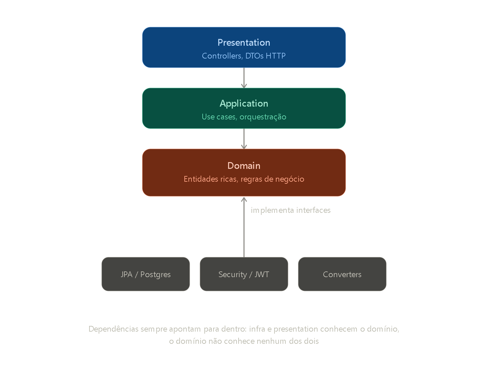

# s.commerce

API de e-commerce para venda de bolos, cupcakes e brigadeiros sob encomenda — desenvolvida como estudo aprofundado de **Domain-Driven Design**, **Clean Architecture** e **SOLID** aplicados a um contexto de negócio real.

O objetivo deste repositório é praticar as metodologias mais utilizadas no mercado através de um domínio com regras reais, não apenas um CRUD genérico.

## Sobre o domínio

O sistema simula a operação de uma confeitaria que vende produtos sob encomenda. Isso trouxe decisões de modelagem que só aparecem quando o domínio tem regras de negócio de verdade: agendamento de entrega com antecedência mínima, snapshot de preço no momento da compra (o preço do produto pode mudar, mas o pedido mantém o valor da época), e carrinho como entidade separada do pedido.

## Arquitetura


O projeto segue Clean Architecture, com dependências sempre apontando para dentro — o domínio não conhece infraestrutura nem apresentação.



```
src/main/java/com/s/commerce/
├── presentation/      Controllers, DTOs HTTP
├── application/       Use cases, orquestração de fluxos
├── domain/             Entidades ricas, value objects, regras de negócio
└── infrastructure/    JPA, Spring Security, JWT, converters
```

Principais decisões aplicadas:

- **Entidades ricas**, não anêmicas — regras de negócio vivem dentro da entidade (ex: `Order.markAsDelivered()`, `OrderStatus` com transições de estado válidas via `EnumSet`)
- **Value Objects** como Java records para IDs e conceitos de domínio (`CartItemId`, `Money`), com invariantes validadas no construtor
- **Hierarquia de exceções de domínio** (`DomainException` → `NotFoundException`, `InvalidArgumentException`, `InvalidOperationException`) tratada de forma centralizada
- **Interfaces no domínio, implementações na infraestrutura** — repositórios, hashing de senha e geração de token são abstraídos via interfaces (`IUserRepository`, `IPasswordHasher`, `ITokenService`)
- **Autenticação stateless via JWT**, com filtro customizado e tratamento de erros desacoplado do fluxo de negócio

## Tecnologias

- Java 21
- Spring Boot 4
- Spring Security
- Spring Data JPA / Hibernate
- PostgreSQL
- JWT (java-jwt)
- Docker Compose
- Swagger / OpenAPI

## Status do projeto

Este é um MVP de backend, em desenvolvimento ativo. Ainda não há front-end.

**Funcionando:**
- Cadastro e autenticação de usuários (JWT)
- Cadastro de produtos
- Carrinho de compras (adicionar, remover itens)
- Checkout do carrinho, com geração de pedido

**Em desenvolvimento:**
- Integração de pagamento
- Painel administrativo de pedidos (atualização de status, entrega)

## Rodando o projeto

### Pré-requisitos

- Java 21
- Maven
- Docker

### Subindo o banco de dados

```bash
docker compose up -d
```

### Rodando a aplicação

```bash
./mvnw spring-boot:run
```

A API estará disponível em `http://localhost:8080`, com a documentação Swagger em `http://localhost:8080/swagger-ui.html`.

## Aprendizados documentados

Este projeto também serve como registro de aprendizado prático. Alguns dos problemas reais enfrentados e resolvidos durante o desenvolvimento:

- Mapeamento correto de relacionamentos JPA (`@OneToMany`/`@ManyToOne`, cascade e `orphanRemoval`)
- Conversores customizados para Value Objects em `@PathVariable` e `@RequestBody`
- Tratamento de exceções desacoplado de Spring Security (forward interno para `/error` e `DispatcherType`)
- Geração e validação de JWT, com tratamento de autenticação e autorização separados

## Licença

Projeto de estudo, sem licença comercial definida.